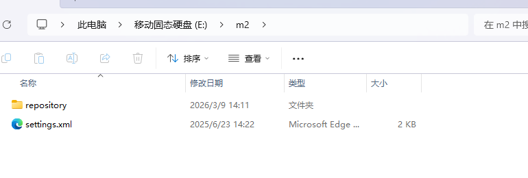
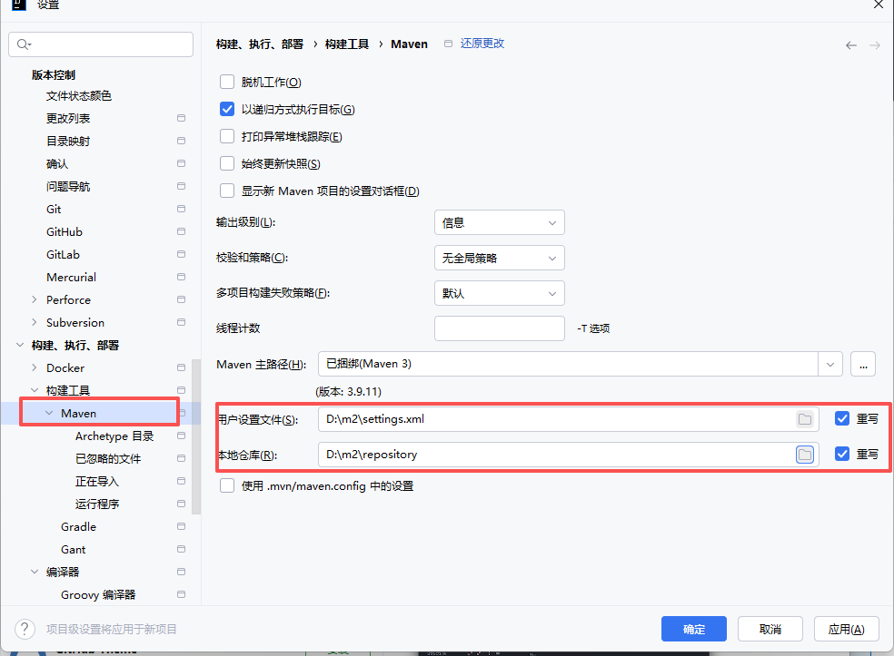
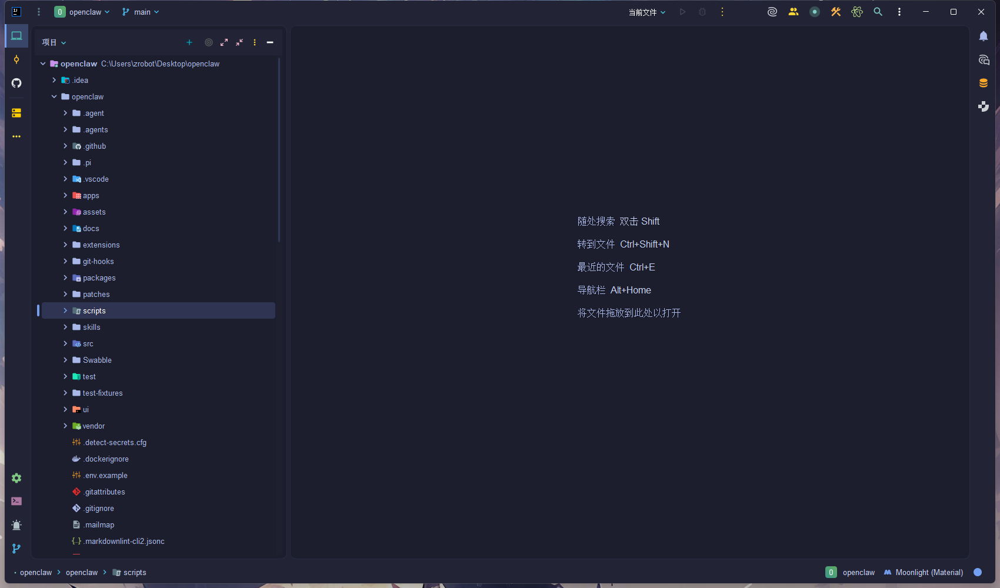

# IDEA 安装配置教程

1. **安装 IDEA**  
   这点无需多言，直接官网下载安装即可。

2. **创建工作空间**  
   在 D 盘或其他空余盘符开辟一个专门的 JavaWorkSpace 文件夹，用来存放 IDEA 项目和代码。  
   推荐路径示例：`D:\JavaWorkSpace`

   

3. **配置 Maven 镜像和本地仓库**  
   - 创建一个 `m2` 文件夹（比如 `D:\m2`），里面放 `settings.xml` 和 `repository`  
   - `settings.xml` 用来配置国内镜像源（阿里云/华为云等），加速依赖下载  
   - `repository` 就是 Maven 本地仓库，存放下载的 jar 包，一开始可以为空

   

4. **在 IDEA 中映射自定义 Maven 设置**  
   打开 IDEA → File → Settings → Build, Execution, Deployment → Build Tools → Maven  
   
   - User settings file：指向你的 `D:\m2\settings.xml`（勾选 Override）  
   - Local repository：指向你的 `D:\m2\repository`
   
   
   
5. **完成！**  
   现在你可以愉快地使用 IDEA 写代码了～

   推荐通过插件市场安装 **Material Theme UI 和 Atom Material lcons** 插件，美观又护眼！

   